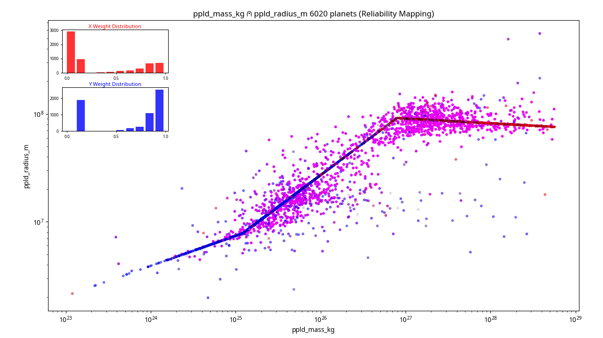
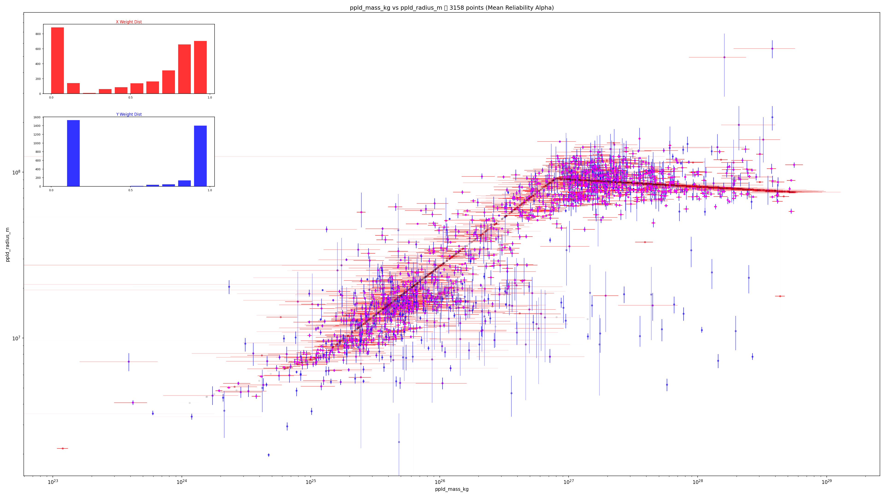
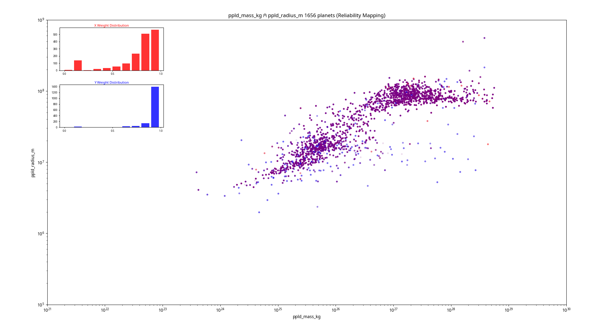
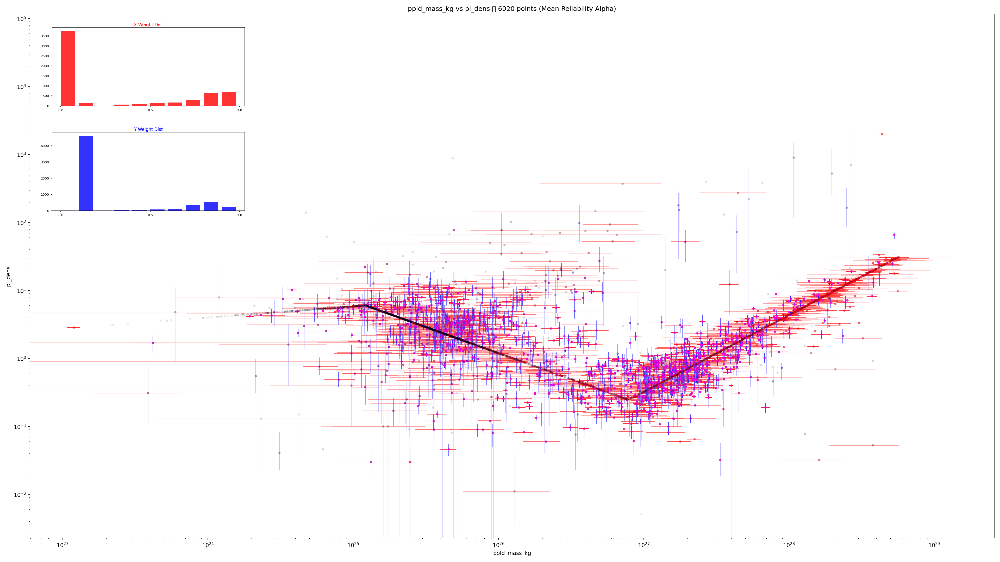
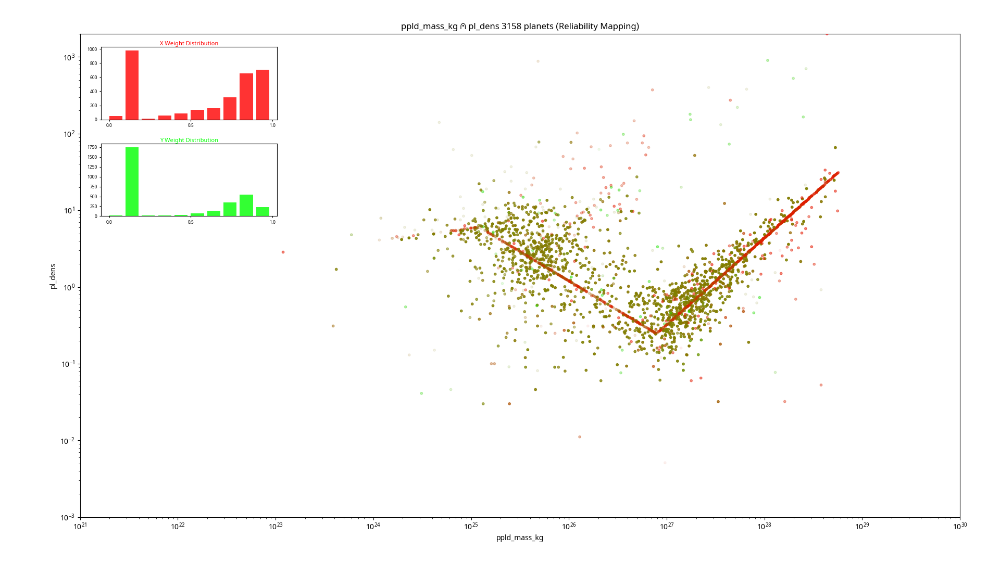
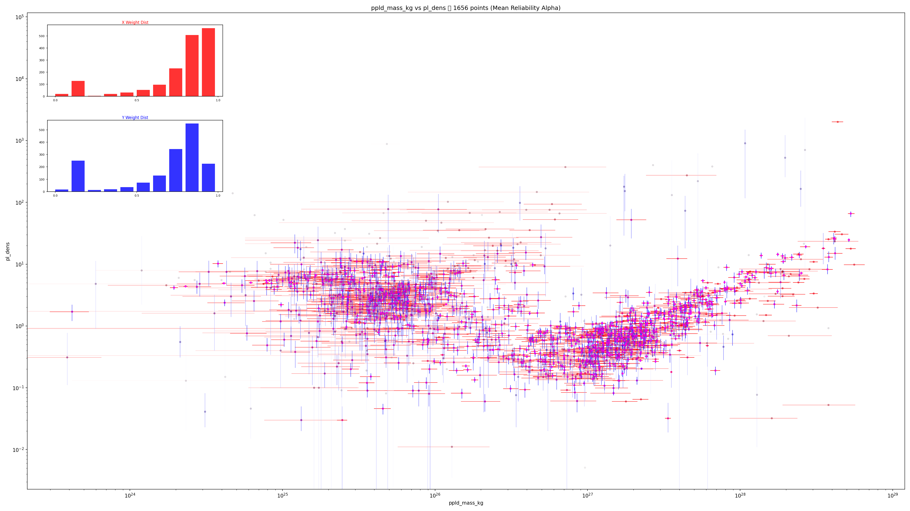

# Exoplanet Mass–Radius–Density–Gravity Dataset

A Python script that queries the [NASA Exoplanet Archive](https://exoplanetarchive.ipac.caltech.edu/) for all confirmed exoplanets with known mass, radius, and density. It then calculates the mass in kilograms and radius in meters, as well as calculates a reliability weighting for each entry, and classifies each planet using the Durand-Manterola (2011) three-class scheme, and exports the result as CSV files. Also creates scatter plots from the data.

---

## Contents

- [Quickstart](#quickstart)
- [Methodology](#methodology)
  - [Data source](#data-source)
  - [Weighting](#weighting)
  - [Surface gravity](#surface-gravity)
  - [Durand-Manterola classification](#durand-manterola-classification)
- [Visualization](#visualization)
- [Caveats and known limitations](#caveats-and-known-limitations)
- [My Observations](#my-observations)
- [Future directions](#future-directions-and-things-to-consider)
- [Citation](#citation)

---

## Quickstart

**Requirements:** Python 3.8+, git

### Automated install (Linux/macOS)

```bash
curl -fsSL https://raw.githubusercontent.com/CoryAlbrecht/planet-power-law-distribution/main/install.sh | bash
```

### Automated install (Windows)

```powershell
irm https://raw.githubusercontent.com/CoryAlbrecht/planet-power-law-distribution/main/install.ps1 | iex
```

## Dependencies

[](https://numpy.org/)
[](https://pandas.pydata.org/)
[](https://matplotlib.org/)

### Manual install

```bash
# Clone repository
$ git clone https://github.com/CoryAlbrecht/planet-power-law-distribution.git
$ cd planet-power-law-distribution

# Create and activate virtual environment
$ python -m venv .venv
$ source .venv/bin/activate  # Linux/macOS
# .\venv\Scripts\Activate.ps1  # Windows

# Install package
$ pip install -e .

# Retrieve data from the NASA Exoplanet Archive database and generate output files
# If the data file is already there and less than a week old, it won't retrieve it again
$ planet-power -r
$ planet-power --retrieve

# Force a data refresh even if the file is less than a week old
$ planet-power -r -R
$ planet-power -r --refresh

# Get the PSCompPars data table instead of the PS data table
$ planet-power -r -p
$ planet-power -r --pscomppars

# Calculate the extra values
$ planet-power --calculate
$ planet-power -c -p

# Create split files for plotting with no filtering, may be with downloaded PSCompPars data
$ planet-power --split
$ planet-power -s -p

# Create split files for plotting with filtering out calculated values from one column
$ planet-power -s --filter "pl_bmassprov:M-R relationship"
$ planet-power -s -f "pl_bmassprov:M-R relationship"

# Create split files for plotting with filtering out calculated values from two columns, using PSCompPars data
$ planet-power -s -p -f "pl_bmassprov:M-R relationship" -f pl_dens_reflink:CALCULATED_VALUE

# Steps can be combind into one invocation
$ planet-power -r -R -p -C -t tag1
$ planet-power -C -p --tag tag1 -s -f "pl_bmassprov:M-R relationship" -c "~pl_bmassj.*" -c pl_bmassprov -c "~pl_radj.*" -c "~pl_dens.*" -c "~ppld_.*"
```

No API key is required. The script queries NASA's public TAP service directly.

---

## CLI Options

| Option                                                      | Description                                                                                                                                                                                                                                                     | Output   |
|-------------------------------------------------------------|-----------------------------------------------------------------------------------------------------------------------------------------------------------------------------------------------------------------------------------------------------------------|----------|
| `-r`, `--retrieve`                                          | Fetch data from NASA Exoplanet Archive                                                                                                                                                                                                                          | CSV      |
| `-R`, `--refresh`                                           | Force refresh of raw data from NASA Exoplanet Archive                                                                                                                                                                                                           | CSV      |
| `-C`, `--calculate`                                         | Create extra CSV file with calculated values not in the NASA Exoplanet Archive data                                                                                                                                                                             | CSV      |
| `-s`, `--split`                                             | Create split files for scatter plots                                                                                                                                                                                                                            | CSV, PNG |
| `-f COLUMN:REGEX`, `--filter COLUMN:REGEX`                  | Filter out rows where COLUMN matches REGEX (can be used multiple times)                                                                                                                                                                                         |          |
| `-t TAG`, `--tag TAG`                                       | Tag to append to split output filenames                                                                                                                                                                                                                         |          |
| `-c COLUMN\|~REGEX\|@FILE`,`--column COLUMN\|~REGEX\|@FILE` | Choose columns for fetching or splitting <ul><li>If the value starts with a ~ it is a reguar expression</li><li>If the value starts with a @ it is a text file with one value per line, no nesting</li><li>Otherwise it is the exact name of a column</li></ul> |          |
| `--help-columns`                                            | List out all avaiable columns                                                                                                                                                                                                                                   |          |

All output data ends up in the `./data` directory.

---

---

## Methodology

### Data source

The script utilizes the NASA Exoplanet Archive TAP service to retrieve the `pscomppars` (Planetary Systems Composite Parameters) table. This table is preferred as it provides a single, representative set of parameters for each planet.

### Weighting

To address the goal of identifying structural breaks without the noise of low-quality data or model-derived values, a normalized weighting system ($0.0$ to $1.0$) is applied to each measurement. The weight is the product of two independent factors, each capturing a different aspect of data quality.

#### 1. Provenance factor ($W_{prov}$)

For mass, the archive's `pl_bmassprov` column records how the best-mass estimate was obtained. The provenance factor penalises measurement types that are less reliable for population-level power-law fitting:

| Provenance         | $W_{prov}$ | Notes                                         |
|--------------------|------------|-----------------------------------------------|
| `Mass`             | 1.0        | True mass from inclination-resolved orbit     |
| `Msin(i)/sin(i)`   | 1.0        | Inclination known; true mass recovered        |
| `Msini`            | 0.2        | Lower bound only; inclination unknown         |
| `M-R relationship` | 0.0        | Fully model-derived via Chen & Kipping (2017) |
| Unknown / missing  | 0.1        | Conservative fallback                         |

Radius and density do not have an equivalent provenance column in the archive, so their provenance factor defaults to $1.0$ and the weight is determined entirely by the precision factor and error completeness below.

#### 2. Error completeness penalty

If both error bars are present, no additional penalty is applied. If only one error bar exists, $W_{prov}$ is multiplied by $0.6$ before the precision factor is calculated — separating the question of *whether* the uncertainty is fully characterised from *how large* it is. If neither error bar is present, the function returns $W_{prov} × 0.1$ immediately as a heavy penalty.

#### 3. Precision factor ($W_{prec}$)

An exponential decay is applied to the relative uncertainty $\delta = \sigma / v$, where $\sigma$ is the mean of the available absolute error bars and $v$ is the measured value:

$$W_{prec} = e^{-\delta}$$

This ensures that points with high relative uncertainty fade naturally while those with small errors relative to their value retain a weight close to $1.0$. Note that $\sigma$ is calculated as the mean of whichever error bars exist — the completeness penalty above handles the asymmetry separately rather than folding it into $\sigma$.

#### Combined weight

$$W = \mathrm{clip}(W_{prov} \cdot W_{prec},\ 0,\ 1)$$

This weighting scheme combines provenance quality with measurement precision using exponential decay of relative uncertainty. It shares the same $[0, 1]$ range as inverse-variance weighting and can be passed directly to fitting routines such as `linmix` or `scipy.odr`. The exponential form is deliberately gentler than $1/\sigma^2$ at large uncertainties, treating poorly-measured planets as low-confidence rather than discarding them.

### Surface gravity

Surface gravity ($g$) is calculated using the standard Newtonian formula:
$$g = \frac{G \cdot M}{R^2}$$
where $M$ is the caclulated mass in kg and $R$ is the calculated radius in meters.

### Durand-Manterola classification

Planets are categorized into three classes based on their mass ($M$):

- **Class A:** $M < 5 \times 10^{25}$ kg (Earth-like/Super-Earths)
- **Class B:** $5 \times 10^{25} \text{ kg} \le M < 1 \times 10^{27}$ kg (Neptune-like/Sub-Saturns)
- **Class C:** $M \ge 1 \times 10^{27}$ kg (Gas Giants/Brown Dwarfs)

---

## Visualization

The script generates high-resolution scatter plots (e.g., Mass vs. Radius) using a **Reliability Color Space** to visually represent the $\u2A40$ intersection of data confidence:

- **Dual-Gradient Error Crosses:** * **Horizontal Bars:** Transition from White ($0.0$) to Red ($1.0$) based on the $x$-axis weighting.
  - **Vertical Bars:** Transition from White ($0.0$) to Blue ($1.0$) based on the $y$-axis weighting.
- **Scatter Points:**
  - The central dots use additive mixing: Red (X-weight) + Blue (Y-weight) = Purple.
  - The opacity (alpha) of the dot is the **arithmetic mean** of the two weights.
- **Weight Distribution Insets:** Small bar charts in the upper-left display decile distributions for both weightings, allowing for immediate assessment of dataset quality and the prevalence of model-contaminated points.

---

## Caveats and known limitations

**PSCompPars is not self-consistent.** Parameters for a single planet may be drawn from different publications. This is appropriate for demographic studies but should be treated with caution for any individual planet.

**Density may be calculated, not measured.** Many densities in the archive are derived from mass and radius rather than independently measured. If your analysis requires only directly measured densities, filter on `pl_dens_reflink NOT LIKE '%alculated%'` (retrievable by adding `pl_dens_reflink` to the query).

**Radius is a transit radius.** It is not a volumetric mean or equatorial radius in the Solar System sense. For gas giants, it is pressure-level and wavelength-dependent. The Jupiter and Earth reference radii used for unit conversion are equatorial values, introducing a small systematic inconsistency.

**DM class boundaries were chosen by eye.** The paper gives no formal method for determining the A/B and B/C boundaries. The text states that planets in different mass ranges "seem to follow" different power laws — the cuts were placed where the slope of the point cloud appeared to change on the log-log plot, with no statistical breakpoint test and no uncertainty on the boundary locations themselves. The correlation coefficients in Table 1 validate the fits *given* the chosen boundaries, but do not independently justify where the boundaries sit. With a modern dataset of thousands of planets, a more rigorous approach would be to treat the boundary locations as free parameters — for example using piecewise regression breakpoint detection (`pwlf`) or a hierarchical Bayesian model — rather than inheriting the 2011 visual judgement. Planets near the boundaries (especially in the B/C transition region around 10²⁷ kg) may be ambiguously classified under the current hard cuts.

**DM power laws were fitted with OLS in log space.** This minimises relative errors and weights all planets equally regardless of measurement quality. It is not equivalent to fitting in linear space, and the resulting coefficients can be sensitive to outliers. Several of the correlation coefficients in the original paper — particularly for surface gravity in Class B (R = 0.248) and radius in Class C (R = 0.120) — fall below or near the paper's own critical significance threshold, so those specific power laws should be interpreted cautiously.

**The 2011 dataset was small.** The paper used 92 transiting exoplanets; the current NASA archive contains several thousand confirmed planets with measured radii. The class structure and power law exponents may shift with the larger, more diverse modern sample.

---

## My Observations

Three distinct groups of planets that can be seen in the unfiltered data with a very strong central line with two knees in it.

- A <= 1.2×10^25
- 1.2×10^25 <= B <= 8.1×10^26
- C >= 8.1×10^26

But the inflection points between the groups are oddly sharp. When a planet has a measured mass but no observed transit radius, the NASA Exoplanet Archive calculates the mass or radius when missing using the Chen & Kipping (2017) piecewise power law. That relation has hard breakpoints built into it — the Archive's own documentation lists the exact boundaries at 2.04, 132, and 26,600 M_Earth, or 1.22×10^25 kg, 7.90×10^26 kg, and 1.589×10^29 kg.

The Exoplanet Archive data has the `pl_bmassprov` column, which means exoplanet mass can be filtered and weight a bit more granularly by mass to help get rid of the Chen & Kipping artefact. While that does work somewhat, making the central line described above  a bit weaker, especially for lower mass planets, we still need to filter out the ones where radius is calculated rather than observed.

 The three groups exist after such weighting and filtering, but are much more fuzzy and closer to Durand-Manterola's originals ranges. Closer analysis needs to be done to see if Durand-Manterola's power law curves are still accurate with the expanded dataset, or if they need to be adjusted.

### Figure 1. Mass vs. Radius

| Unfiltered, showing Chen & Kipping piecewise power law artefact                         | Filtered                                                                          | Filtered More                                                                          |
|-----------------------------------------------------------------------------------------|-----------------------------------------------------------------------------------|----------------------------------------------------------------------------------------|
| 6,020 records                                                                           | 3,158 records                                                                     | 1,656                                                                                  |
|  |  |  |

### Figure 2. Mass vs. Density

| Unfiltered, showing Chen & Kipping piecewise power law artefact                           | Filtered                                                                            | Filtered More                                                                            |
|-------------------------------------------------------------------------------------------|-------------------------------------------------------------------------------------|------------------------------------------------------------------------------------------|
| 6,020 records                                                                             | 3,158 records                                                                       | 1,656                                                                                    |
|  |  |  |

---

## Future directions and things to consider

**Refit the power laws on the modern dataset.** With thousands of planets now available, the Durand-Manterola exponents could be refitted and compared to the 2011 values. This would test whether the classification scheme holds at scale. **Segemented Regression**, the **Chow test**, and **Recursive Residuals**

**Use better fitting methods.** Ordinary least squares in log space assumes symmetric, equal-weight Gaussian errors on logged quantities — a poor match to real exoplanet data. More appropriate methods include:

- *Weighted least squares* — weights each point by 1/σ², respecting measurement quality
- *Orthogonal distance regression (ODR)* — accounts for uncertainties on both axes (`scipy.odr`)
- *Bayesian regression with intrinsic scatter* — the standard modern approach; the `linmix` package (Kelly 2007) is designed for exactly this use case

**Treat class boundaries as uncertain.** The hard mass cuts could be replaced with a mixture model or a hierarchical Bayesian model that allows planets near the boundaries to have probabilistic class membership.

**Separate calculated from measured densities.** Rerunning the analysis on the subset with directly measured densities would test whether the power law structure is robust to the archive's density imputation.

**Add escape velocity.** Durand-Manterola's toy model [https://arxiv.org/abs/1111.3986]((Figure 5)) uses escape velocity to explain volatile retention in Class B. This is straightforward to calculate from the same mass and radius data and would add physical context to the dataset.

**Add more advanced data filtering.** Currently filtering is simplistic. If a row has a field that matches a filter from the command line, that row is discarded. More research needs to be done to see if this simple, indiscrimnate filtering is necessary due to Chen's & Kipping's piecewise power law speading to other columns, or if more sophistacted filtered (i.e. boolean logic) could increase the size of the comparison sets.

---

## Citation

If you use this dataset or script in your work, please cite the NASA Exoplanet Archive:

> NASA Exoplanet Archive. Planetary Systems Composite Parameters Table.
> DOI: [10.26133/NEA12](https://doi.org/10.26133/NEA12)

For the Durand-Manterola classification:

> Durand-Manterola, H.J. (2011). Planets: Power Laws and Classification.
> DOI [arXiv:1111.3986](https://arxiv.org/abs/1111.3986)

For the mass-radius relation used by the archive to fill missing radii/masses:

> Chen, J., & Kipping, D. (2017). Probabilistic Forecasting of the Masses and Radii of Other Worlds. *ApJ*, 834, 17.
> DOI: [10.3847/1538-4357/834/1/17](https://doi.org/10.3847/1538-4357/834/1/17)

For statistical methods

> Kelly, Brandon C. (2007) Some Aspects of Measurement Error in Linear Regression of Astronomical Data
> DOI: [10.1086/519947](https://iopscience.iop.org/article/10.1086/519947)
